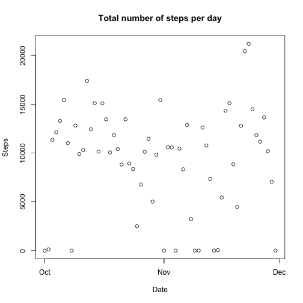
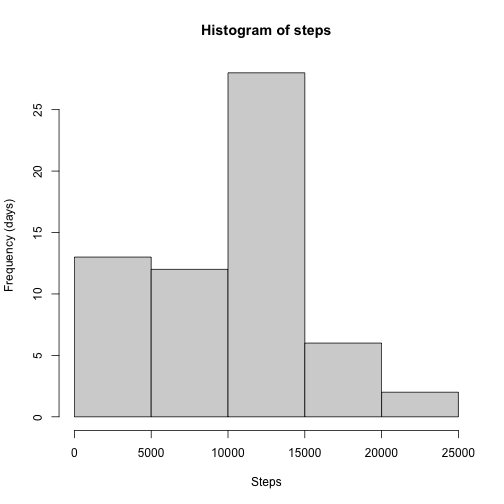
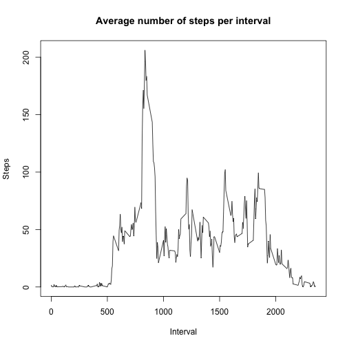
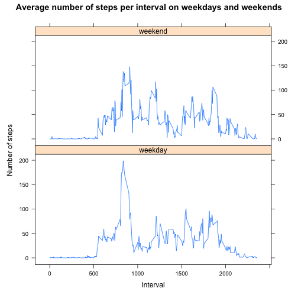

## Loading and preprocessing the data

First we globally set echo to TRUE.


```r
knitr::opts_chunk$set(echo=TRUE)
```

then we load some libraries which we will use later.


```r
library(dplyr)
```

```
## 
## Attaching package: 'dplyr'
```

```
## The following objects are masked from 'package:stats':
## 
##     filter, lag
```

```
## The following objects are masked from 'package:base':
## 
##     intersect, setdiff, setequal, union
```

```r
library(lattice)
```

### 1. Loading the data

```r
if (!file.exists('activity.csv')) {
  unzip('activity.zip')
}
data <- read.csv('activity.csv', sep=',')
```

### 2. Pre-processing

We convert date strings to date objects. Reason: this will give better tick-labeling when plotting a time series.


```r
data$date <- as.POSIXct(data$date, format="%Y-%m-%d")
```

## What is mean total number of steps taken per day?

### 1. Total number of steps per day

Total per day is:

```r
total_data <- data %>% 
  group_by(date) %>%
  summarise(total = sum(steps, na.rm = TRUE))
with(total_data, plot(date, total, xlab='Date', ylab='Steps', main='Total number of steps per day'))
```



### 2. Histogram of totals per day

Let's first look at a histogram of the steps:

```r
with(total_data, hist(total, main='Histogram of steps', xlab='Steps', ylab='Frequency (days)'))
```



### 3. Calculate mean and median of totals per day

Mean of the totals per day is:

```r
with(total_data, mean(total))
```

```
## [1] 9354.23
```

Median of the totals per day is:

```r
with(total_data, median(total))
```

```
## [1] 10395
```


## What is the average daily activity pattern?

### 1. Time series plot of 5 min interval


```r
time_data <- data %>% 
  group_by(interval) %>%
  summarise(Mean = mean(steps, na.rm = TRUE))

with(time_data, plot(interval, Mean, type='l', xlab='Interval', ylab='Steps', main='Average number of steps per interval'))
```



### 2. Which interval contains max number of steps?

We now calculate the maximum of the mean value per interval and determine in what interval that maximum occurs.


```r
max_total <- with(time_data, max(Mean, na.rm = TRUE))
pos_max = with(time_data, which.max(Mean))
max_interval <- time_data[pos_max,]$interval
print(paste("Maximum number of average steps is ", max_total, ", which occurred in interval ", max_interval))
```

```
## [1] "Maximum number of average steps is  206.169811320755 , which occurred in interval  835"
```

## Imputing missing values

### 1. Total number of records with  missing values


```r
print(paste("There are ", sum(is.na(data$steps)), " records with missing values"))
```

```
## [1] "There are  2304  records with missing values"
```


### 2. Filling in all of the missing values

Strategy: We use the *median per interval* to fill in missing values for that day.

### 3. Create a new dataset that is equal to the original dataset but with the missing data filled in

We now create a new dataset `imputed_data` with missing data filled in according to the strategy mentioned above.

```r
imputed_data <- data %>% 
  group_by(interval) %>% 
  mutate(steps = ifelse(is.na(steps), 
                        median(steps, na.rm = TRUE), 
                        steps))

print(paste("After imputation there are ", sum(is.na(imputed_data$steps)), " records with missing values"))
```

```
## [1] "After imputation there are  0  records with missing values"
```

### 4. Make a histogram of the total number of steps taken each day and Calculate and report the mean and median total number of steps taken per day.


```r
total_imputed_data <- imputed_data %>% 
  group_by(date) %>%
  summarise(Sum = sum(steps))
```

Let's first look at a histogram of the steps:

```r
with(total_imputed_data, hist(Sum, main='Histogram of steps', xlab='Steps',    ylab='Frequency (days)'))
```


### 3. Calculate mean and median of totals per day

Mean of the totals per day is:

```r
with(total_imputed_data, mean(Sum))
```

```
## [1] 9503.869
```

Median of the totals per day is:

```r
with(total_imputed_data, median(Sum))
```

```
## [1] 10395
```

We see that the mean of the data with imputed values:

1. has become lower, and 
2. the median of the imputed data is the same as for the original data where we calculated them ignoring `NA` values.


## Are there differences in activity patterns between weekdays and weekends?


### 1. Create new factor variable weekday

We create a new factor 'weekday', which will get the value 'weekend' for Saturdays and Sundays, and 'weekday' for all other days.

```r
ndata <- imputed_data %>% 
  mutate(weekday=ifelse(weekdays(as.Date(date)) %in% c('Saturday', 'Sunday'), 'weekend', 'weekday'))
head(ndata)
```

```
## # A tibble: 6 × 4
## # Groups:   interval [6]
##   steps date                interval weekday
##   <int> <dttm>                 <int> <chr>  
## 1     0 2012-10-01 00:00:00        0 weekend
## 2     0 2012-10-01 00:00:00        5 weekend
## 3     0 2012-10-01 00:00:00       10 weekend
## 4     0 2012-10-01 00:00:00       15 weekend
## 5     0 2012-10-01 00:00:00       20 weekend
## 6     0 2012-10-01 00:00:00       25 weekend
```

### 2. Make a panel plot containing a time series plot of the 5-minute interval (x-axis) and the average number of steps taken, averaged across all weekday days or weekend days (y-axis).

We split the data set in separate sets for weekend and weekdays and take the average for each interval.


```r
tdata <- ndata %>% 
  group_by(weekday, interval) %>%
  summarise(avg = mean(steps, na.rm = TRUE))
```

```
## `summarise()` has grouped output by 'weekday'. You can override using the
## `.groups` argument.
```

```r
xyplot(avg ~ interval | factor(weekday), 
   data = tdata,
   ylab='Number of steps',
   xlab='Interval',
   main="Average number of steps per interval on weekdays and weekends",
   panel = function(x, y,...) {
           panel.xyplot(x, y,...)
           },
   type='l',
   layout=c(1,2)
   ) 
```




